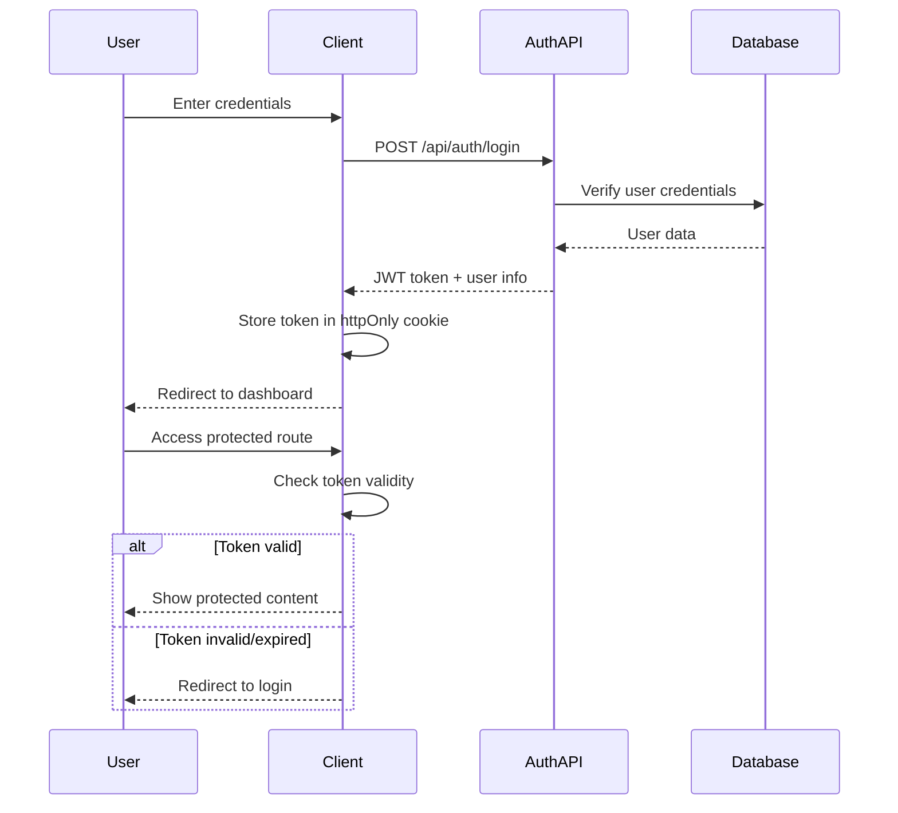

# User Authentication System Design

## Overview

The user authentication system will be implemented using Next.js 14 App Router with a modern, secure approach. The system will use JWT tokens for session management, bcrypt for password hashing, and a file-based JSON database for user storage (suitable for development and small-scale deployment). The authentication will be integrated seamlessly with the existing Digital Transformation Planner interface.

## Architecture

### Authentication Flow



### Session Management

- JWT tokens stored in httpOnly cookies for security
- Token expiration set to 7 days with automatic refresh
- Server-side token validation on protected routes
- Graceful handling of expired tokens with redirect to login

## Components and Interfaces

### Authentication Context

```typescript
interface AuthContextType {
  user: User | null
  login: (email: string, password: string) => Promise<void>
  logout: () => void
  register: (email: string, password: string) => Promise<void>
  resetPassword: (email: string) => Promise<void>
  updatePassword: (token: string, newPassword: string) => Promise<void>
  isLoading: boolean
  error: string | null
}
```

### User Interface

```typescript
interface User {
  id: string
  email: string
  createdAt: string
  lastLoginAt: string
}

interface UserRecord extends User {
  passwordHash: string
  resetToken?: string
  resetTokenExpiry?: string
}
```

### API Endpoints

#### Authentication Routes

- `POST /api/auth/register` - User registration
- `POST /api/auth/login` - User login
- `POST /api/auth/logout` - User logout
- `GET /api/auth/me` - Get current user
- `POST /api/auth/forgot-password` - Request password reset
- `POST /api/auth/reset-password` - Reset password with token

#### Middleware

- `middleware.ts` - Route protection and token validation
- Protected routes: `/dashboard/*`, `/profile/*`
- Public routes: `/`, `/login`, `/register`, `/forgot-password`, `/reset-password`

### UI Components

#### Authentication Pages

- `src/app/login/page.tsx` - Login form
- `src/app/register/page.tsx` - Registration form
- `src/app/forgot-password/page.tsx` - Password reset request
- `src/app/reset-password/page.tsx` - Password reset form

#### Shared Components

- `src/components/auth/LoginForm.tsx` - Reusable login form
- `src/components/auth/RegisterForm.tsx` - Reusable registration form
- `src/components/auth/AuthGuard.tsx` - Route protection wrapper
- `src/components/auth/UserMenu.tsx` - User dropdown with logout

## Data Models

### User Storage

```json
{
  "users": [
    {
      "id": "uuid-string",
      "email": "user@example.com",
      "passwordHash": "bcrypt-hashed-password",
      "createdAt": "2024-01-01T00:00:00.000Z",
      "lastLoginAt": "2024-01-01T00:00:00.000Z",
      "resetToken": "optional-reset-token",
      "resetTokenExpiry": "optional-expiry-date"
    }
  ]
}
```

### Database Operations

- File-based JSON storage in `data/users.json`
- Atomic write operations to prevent data corruption
- User lookup by email and ID
- Password reset token management

### Security Considerations

- Passwords hashed using bcrypt with salt rounds of 12
- JWT tokens signed with secure secret key
- Reset tokens expire after 1 hour
- Rate limiting on authentication endpoints
- Input validation and sanitization

## Error Handling

### Client-Side Error States

- Network connectivity errors
- Invalid form submissions
- Authentication failures
- Token expiration handling

### Server-Side Error Responses

```typescript
interface AuthError {
  error: string
  message: string
  statusCode: number
}
```

### Error Categories

- `400 Bad Request` - Invalid input data
- `401 Unauthorized` - Invalid credentials or expired token
- `404 Not Found` - User not found
- `409 Conflict` - Email already exists
- `429 Too Many Requests` - Rate limit exceeded
- `500 Internal Server Error` - Server-side errors

## Testing Strategy

### Unit Tests

- Authentication utility functions
- Password hashing and validation
- JWT token generation and verification
- Form validation logic

### Integration Tests

- API endpoint functionality
- Database operations
- Authentication flow end-to-end
- Error handling scenarios

### Component Tests

- Form submission handling
- Error state display
- Loading state management
- User interaction flows

### Security Tests

- Password strength validation
- Token expiration handling
- Protected route access
- CSRF protection verification

## Implementation Phases

### Phase 1: Core Authentication Infrastructure

- Set up authentication context and providers
- Implement JWT token utilities
- Create user database schema and operations
- Build basic login/logout functionality

### Phase 2: User Registration and Management

- User registration with validation
- Password reset functionality
- User profile management
- Email verification (future enhancement)

### Phase 3: UI Integration and Protection

- Authentication forms and pages
- Route protection middleware
- User menu and navigation updates
- Error handling and user feedback

### Phase 4: Security Hardening and Testing

- Rate limiting implementation
- Security headers and CSRF protection
- Comprehensive testing suite
- Performance optimization

## Integration with Existing Application

### Layout Updates

- Add authentication provider to root layout
- Include user menu in navigation
- Handle authentication state in main components

### Route Protection

- Protect strategy canvas and recommendations
- Redirect unauthenticated users to login
- Maintain user session across page refreshes

### Data Persistence

- Associate user strategies with user accounts
- Save user preferences and settings
- Enable strategy sharing and collaboration (future)

## Dependencies

### New Dependencies Required

```json
{
  "dependencies": {
    "bcryptjs": "^2.4.3",
    "jsonwebtoken": "^9.0.2",
    "uuid": "^9.0.1"
  },
  "devDependencies": {
    "@types/bcryptjs": "^2.4.6",
    "@types/jsonwebtoken": "^9.0.5",
    "@types/uuid": "^9.0.7"
  }
}
```

### Utility Libraries

- `bcryptjs` - Password hashing
- `jsonwebtoken` - JWT token management
- `uuid` - Unique identifier generation
- Built-in Next.js features for API routes and middleware
